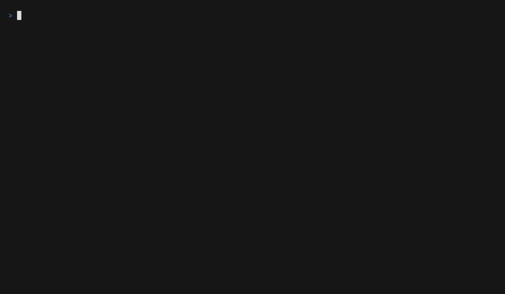

# trustdiff

trustdiff is a single-binary command line tool that finds trust regressions in a project's dependency tree before they land. A trust regression is not a change in a package's code but a change in the signals that made the package trustworthy: a version published by an account that never published one before, a release that lost the provenance every earlier release had, a version that adds an install script or a dependency the previous one did not have, a name one keystroke away from a popular package, a version with a known malicious or vulnerable advisory. Each of these preceded a real incident (event-stream in 2018, ua-parser-js in 2021, Shai-Hulud in 2025, axios in 2026), and each is visible in registry metadata before anyone has looked at the code. Cooldowns buy time and malware feeds catch what is already known; trustdiff tells you, across npm (npm, pnpm, yarn, bun), PyPI (pip, uv, poetry) and crates.io, in one binary with no account and no telemetry, that a dependency's trust signals regressed relative to its own history.

Version 0.4.1 ships `check` for single packages and for a manifest read at the versions its ranges resolve to, `diff` for pull requests with the GitHub Action, the pre-commit hook and SARIF output, `doctor` for the hardening settings your package managers already support, `baseline` for the registries that only answer about now, an offline advisory mirror, and a Bun scanner that stops an install before anything reaches the disk. It reads nine lockfile formats and evaluates npm, PyPI, crates.io and JSR; see the [roadmap](#roadmap).

## Demo



The same two commands in text, because a GIF cannot be searched, copied or read by
anyone using a screen reader, and because these are what the release checklist
verifies against a live run. Captured on 2026-09-10. The twelve lines about a lockfile entry that a ref named on the command line does not have are trimmed here:

```
$ trustdiff check npm:express@4.19.2 pypi:requests cargo:serde
npm:express@4.19.2  OK

pypi:requests@2.34.2  OK
  skipped TD002: pypi records no publisher per version; the run read no baseline
  skipped TD003: pypi records no maintainer set per version; the run read no baseline

cargo:serde@1.0.229  WARN
  warn
    TD006 install-script-present: Runs code at install time: build.rs
      1.0.229 ships a build script (build.rs), which cargo compiles and runs before building the
      crate
  skipped TD003: cargo records no maintainer set per version; the run read no baseline

3 subjects, 0 block, 1 warn, 0 info, 15 skipped checks. Exit code 0 (no blocking findings).
```

`flatmap-stream@0.1.1` is the package that carried the 2018 event-stream backdoor. npm removed it from the registry, so the history checks have nothing to compare and say so; the advisory and download checks still run (the other nine skipped lines are trimmed here):

```
$ trustdiff check npm:flatmap-stream@0.1.1
npm:flatmap-stream@0.1.1  BLOCK
  block
    TD009 malicious-advisory: malicious-package advisory MAL-2025-20690
      OSV lists 1 malicious-package advisory for npm:flatmap-stream@0.1.1: MAL-2025-20690 (Malicious
      code in flatmap-stream (npm)) at https://osv.dev/vulnerability/MAL-2025-20690; deps.dev flags
      npm:flatmap-stream@0.1.1 as malicious: MALICIOUS finding (RISK_CRITICAL)
    TD010 vulnerability: GHSA-9x64-5r7x-2q53: critical severity vulnerability (CVSS 9.8)
      OSV advisory GHSA-9x64-5r7x-2q53 affects npm:flatmap-stream@0.1.1 with severity critical (CVSS
      9.8): Malicious Package in flatmap-stream, see
      https://osv.dev/vulnerability/GHSA-9x64-5r7x-2q53; the policy reports vulnerabilities of
      severity high or above (vulnerability.min_severity)
    TD010 vulnerability: GHSA-mh6f-8j2x-4483: critical severity vulnerability (CVSS 9.8)
      OSV advisory GHSA-mh6f-8j2x-4483 affects npm:flatmap-stream@0.1.1 with severity critical (CVSS
      9.8): Critical severity vulnerability that affects event-stream and flatmap-stream, see
      https://osv.dev/vulnerability/GHSA-mh6f-8j2x-4483; the policy reports vulnerabilities of
      severity high or above (vulnerability.min_severity)
  info
    TD012 low-usage: 97 weekly downloads, below 500
      the registry reports 97 downloads in the last week for npm:flatmap-stream, below the policy
      threshold of 500 (low-usage.min_weekly_downloads)
  skipped TD001: registry: version info of npm:flatmap-stream@0.1.1: npm: flatmap-stream@0.1.1: not found in the registry
  ...

1 subject, 3 block, 0 warn, 1 info, 12 skipped checks. Exit code 1 (blocking findings).
```

## Install

With a Go toolchain (1.26 or newer):

```sh
go install github.com/vahapogut/trustdiff/cmd/trustdiff@latest
```

With a package manager:

```sh
# macOS
brew install --cask vahapogut/tap/trustdiff

# Windows
scoop bucket add trustdiff https://github.com/vahapogut/scoop-bucket
scoop install trustdiff
```

Both point at [vahapogut/homebrew-tap](https://github.com/vahapogut/homebrew-tap) and [vahapogut/scoop-bucket](https://github.com/vahapogut/scoop-bucket), which hold one generated file each beside a README and the license.

The Homebrew line names the cask in full on purpose. Since Homebrew 6.0 a tap that is not one of Homebrew's own has to be trusted before its code will run, and installing a fully qualified name trusts that one cask and nothing else. `brew tap vahapogut/tap` followed by the short name needs a separate `brew trust --cask vahapogut/tap/trustdiff`, and `brew trust vahapogut/tap` accepts everything the tap ever holds, which is more than anyone should hand a third party.

The route that works on every platform, and the only one that lets you check the signature and the provenance yourself, is to download a release from the [releases page](https://github.com/vahapogut/trustdiff/releases). Every release ships one archive per platform (`trustdiff_<version>_<os>_<arch>.tar.gz`, `.zip` on Windows), `checksums.txt`, its cosign bundle `checksums.txt.sigstore.json`, an SPDX SBOM per archive and GitHub build provenance. Download the archive for your platform together with the two checksum files and verify before you unpack; substitute the archive you downloaded for `trustdiff_0.4.1_linux_amd64.tar.gz`.

1. Verify the signature on the checksum file (cosign v3 or later). The identity is the release workflow of this repository, running on a version tag.

   ```sh
   cosign verify-blob \
     --bundle checksums.txt.sigstore.json \
     --certificate-identity-regexp '^https://github\.com/vahapogut/trustdiff/\.github/workflows/release\.yml@refs/tags/v' \
     --certificate-oidc-issuer https://token.actions.githubusercontent.com \
     checksums.txt
   ```

2. Verify the archive against the signed checksum file.

   ```sh
   sha256sum --check --ignore-missing checksums.txt          # Linux
   shasum -a 256 --check --ignore-missing checksums.txt      # macOS
   ```

   On Windows, compare the two outputs by eye:

   ```powershell
   (Get-FileHash .\trustdiff_0.4.1_windows_amd64.zip -Algorithm SHA256).Hash
   Select-String windows_amd64 .\checksums.txt
   ```

3. Verify the build provenance with the GitHub CLI.

   ```sh
   gh attestation verify trustdiff_0.4.1_linux_amd64.tar.gz \
     --owner vahapogut \
     --signer-workflow vahapogut/trustdiff/.github/workflows/release.yml
   ```

On macOS, expect the first run to be refused with a message about the developer not being verified. That is Gatekeeper, and it is expected: these binaries carry a cosign signature and build provenance, which anyone can check, rather than an Apple Developer ID, which expires and says nothing about what is in the binary. [docs/adr/0004-macos-notarization.md](docs/adr/0004-macos-notarization.md) records why that trade was made deliberately.

Gatekeeper only looks at a file that something marked as downloaded, and what marks it is the program that fetched it and the program that unpacked it. So how you got trustdiff decides whether you meet it at all:

| How you got trustdiff | First run |
|---|---|
| `go install` | fine |
| `curl` or `wget`, then `tar -xzf` in a terminal | fine |
| Downloaded in a browser, then `tar -xzf` in a terminal | fine |
| Downloaded in a browser, then unpacked by double-clicking in Finder | refused |
| `brew install --cask` | refused |

Browsers mark what they download; `curl`, `wget` and `scp` do not. Unpacking with `tar` from a shell does not carry the mark onto the extracted binary, while Finder's Archive Utility does. The verification steps above are shell commands, so following them lands you in a clean row. Homebrew is the exception in the other direction: it marks what a cask installs on purpose, and the flag that used to turn that off has been removed, so the tap is not a way around this.

Where you do meet it, clear the mark once you have verified the download:

```sh
xattr -d com.apple.quarantine "$(which trustdiff)"
```

Do not double-click the binary in Finder to run it. Finder hands a command line tool to Terminal as a document, and Apple documents that as always blocked, notarized or not.

The last two rows are what notarization would fix and nothing else would, which is the whole content of that decision. None of this was tested on a Mac; this environment has none, and it is read off Apple's and Homebrew's own documentation.

If any step fails, do not run the binary; [SECURITY.md](SECURITY.md) says where to report it. These three steps stay the recommended install even though the tap and the bucket work, because they are the only route that lets you check the signature and the provenance yourself. [docs/releasing.md](docs/releasing.md) describes how a release is built.

## Three ways to use it

### 1. About to add a dependency

`trustdiff check <ecosystem>:<name>[@<version>]` prints one card per package: age, publisher continuity, maintainers, provenance, install scripts, dependencies added since the previous version, look-alike names, advisories, downloads. Without a version the latest non-prerelease version is evaluated. The ecosystems are `npm`, `pypi`, `cargo` and `jsr`. A `deno:` ref is accepted and every check reports itself as skipped: Deno packages live on JSR, and deno.land/x exposes none of the publisher, provenance or download data these checks read.

`check` also takes the path of a manifest: `trustdiff check package.json`, `pyproject.toml` or `Cargo.toml` reads that file's direct dependencies and evaluates each at the version its declared range resolves to today. Ranges are matched by trustdiff itself, in the grammar the ecosystem uses: node-semver range sets for npm, Cargo requirements for crates.io, PEP 440 specifier sets for PyPI, and Poetry's mixture of the two. A declaration nothing can be resolved from, a path dependency or a workspace protocol among them, is listed beside the report with the reason rather than passed over. This is the 2018 handover of event-stream as the registry still records it:

```
$ trustdiff check npm:event-stream@3.3.5
npm:event-stream@3.3.5  BLOCK
  block
    TD002 publisher-changed: Published by right9ctrl, which published none of the previous 5 versions
      the previous 5 versions (3.3.4, 3.3.3, 3.3.2, 3.3.1, 3.3.0) were published by dominictarr;
      3.3.5 was published by right9ctrl, an account that published none of them
  warn
    TD003 maintainers-changed: Maintainers changed since 3.3.4: added right9ctrl
      3.3.4 listed dominictarr as maintainer; 3.3.5 lists dominictarr and right9ctrl: added
      right9ctrl

1 subject, 1 block, 1 warn, 0 info, 4 skipped checks. Exit code 1 (blocking findings).
```

The exit code is for scripts: 0 means no blocking findings, 1 means at least one finding at or above `--fail-on` (default `block`), 2 a usage or configuration error, 3 that a required data source was unavailable and the policy says `on_data_unavailable: fail`. Findings are never hidden by an error; what could not be evaluated is listed as skipped.

`--format json` writes the same run as a document with a published schema ([schema/report.v1.json](schema/report.v1.json)); fields are added within a schema version, never renamed:

```
$ trustdiff --format json check cargo:serde@1.0.210
{
  "schema": "trustdiff.report/1",
  "tool": {
    "name": "trustdiff",
    "version": "dev",
    "commit": "none",
    "date": "unknown",
    "go_version": "go1.26.8"
  },
  "policy": {
    "path": "",
    "cooldown": "3d",
    "fail_on": "block"
  },
  "subjects": [
    {
      "ref": {
        "ecosystem": "cargo",
        "name": "serde",
        "version": "1.0.210"
      },
      "evaluated": [
        "TD001",
        "TD002",
        "TD004",
        "TD006",
        "TD007",
        "TD008",
        "TD009",
        "TD010",
        "TD011",
        "TD012",
        "TD015"
      ],
      "skipped": [
        {
          "check": "TD003",
          "reason": "cargo records no maintainer set per version; the run read no baseline"
        },
        {
          "check": "TD013",
          "reason": "no lockfile entry for cargo:serde@1.0.210: the ref was named directly, not read from a lockfile"
        },
        {
          "check": "TD014",
          "reason": "no lockfile entry for cargo:serde@1.0.210: the ref was named directly, not read from a lockfile"
        },
        {
          "check": "TD016",
          "reason": "no lockfile entry for cargo:serde@1.0.210: the ref was named directly, not read from a lockfile"
        },
        {
          "check": "TD017",
          "reason": "no lockfile entry for cargo:serde@1.0.210: the ref was named directly, not read from a lockfile"
        }
      ],
      "findings": [
        {
          "id": "TD006",
          "name": "install-script-present",
          "level": "warn",
          "ref": {
            "ecosystem": "cargo",
            "name": "serde",
            "version": "1.0.210"
          },
          "title": "Runs code at install time: build.rs",
          "explanation": "1.0.210 ships a build script (build.rs), which cargo compiles and runs before building the crate",
          "evidence": {
            "script_names": [
              "build.rs"
            ],
            "scripts": {
              "build.rs": "build script runs at compile time"
            }
          }
        }
      ],
      "verdict": "warn"
    }
  ],
  "summary": {
    "subjects": 1,
    "findings": {
      "block": 0,
      "info": 0,
      "warn": 1
    },
    "skipped": 4,
    "exit_code": 0,
    "exit_meaning": "no blocking findings"
  }
}
```

If you install with Bun, the same evaluation can run before anything is written to disk. Bun hands every package it is about to fetch, transitive dependencies included, to the scanner named in `bunfig.toml`, and [`@trustdiff/bun-scanner`](integrations/bun-scanner/README.md) is such a scanner: it runs the binary you already have and cancels the install on a blocking finding. It has no dependencies and no network of its own, and a package it could not check is reported rather than passed over, because an install where nothing could be checked should not look like an install where nothing was wrong.

```toml
# bunfig.toml
[install.security]
scanner = "@trustdiff/bun-scanner"
```

### 2. A pull request gate

`trustdiff diff` evaluates only what a lockfile change adds or modifies, against a git base that defaults to the merge base with `origin/main`. It reads `package-lock.json`, `pnpm-lock.yaml`, `yarn.lock`, `bun.lock`, `deno.lock`, `uv.lock`, `poetry.lock`, `Cargo.lock` and `requirements` files, and every finding carries the lockfile line the entry sits on:

```sh
trustdiff diff --format markdown
```

```
## trustdiff: 1 subject, 0 block, 2 warn, 0 info, 13 skipped checks

| Package | Level | Check | Finding | Location |
| --- | --- | --- | --- | --- |
| npm:demo-crypto-helper@1.0.2 | warn | TD001 young-version | Published 2d2h47m15s ago, inside the 3d cooldown | package-lock.json:32 |
| npm:demo-crypto-helper@1.0.2 | warn | TD006 install-script-present | Runs code at install time: postinstall | package-lock.json:32 |

Exit code 0 (no blocking findings).
```

In a workflow, write SARIF instead and let code scanning put those findings on the diff:

```yaml
- uses: vahapogut/trustdiff@v0.4.1
  with:
    version: v0.4.1
    fail-on: block
    format: sarif
```

`version` is given explicitly because the action's own default lags one release
behind. The checksum table it verifies a download against can only be written after
the archives exist, so the commit that fills it in comes after the tag, and the
action at tag `v0.4.1` still defaults to downloading `v0.4.0`.

The action downloads the pinned release, verifies it against checksums signed with cosign before running it, and uploads the SARIF. The job needs `security-events: write` for that upload. A pull request from a fork gets a read-only token whatever the workflow asks for, so there the action skips the upload and prints the findings in the job log instead of failing on a permission the change cannot be given. Or run the binary yourself:

```sh
trustdiff diff --base "$BASE_SHA" --format sarif > trustdiff.sarif
```

`trustdiff scan` evaluates every entry of every lockfile it finds, which is the first-adoption pass rather than the gate. `trustdiff hook install` writes a pre-commit hook that runs the same diff locally, and `.pre-commit-hooks.yaml` offers it to pre-commit users. Exceptions live in `.trustdiff.yaml` with a reason and an expiry date and are reviewed like code.

A note on what the gate compares against: the previous version of a package is the release before the one you are getting, and separately the version your project actually had. Upgrading across several releases makes those differ, and `diff` uses both, so a postinstall script that arrived two releases ago is still reported as new to your project.

### 3. Auditing a repository's own settings

Your package managers already have the settings that would have stopped most of this, and almost nobody has them on. `doctor` walks a repository, finds every package manager by its lockfile, manifest and `packageManager` field, and says which hardening settings are set, which are missing, and which are set to something that does not do what the person who wrote it expected:

```sh
trustdiff doctor
```

```
bun 1.4.2  (version from the packageManager field of apps/native/package.json, apps/native)
  wrong           DR030 bun-minimum-release-age  apps/native/bunfig.toml:3
      10080 is 168 minutes, and the policy asks for 3 days (259200 here). 10080 is 1 week in
      minutes, the unit pnpm and Yarn count in
  advice          DR031 bun-security-scanner  apps/native/bunfig.toml

pnpm 11.2.0  (version from the packageManager field of apps/web/package.json, apps/web)
  wrong           DR010 pnpm-minimum-release-age  apps/web/pnpm-workspace.yaml:5
      60 is 1 hour, and the policy asks for 3 days (4320 here)
  set             DR011 pnpm-strict-dep-builds  apps/web/pnpm-workspace.yaml
      not set, and this version defaults to true
```

The units are the point. The same three days is `3` for npm, `4320` for pnpm and Yarn, `259200` for Bun, `P3D` for Deno and pip and `"3 days"` for uv and Renovate, and every one of those is a valid number in every one of those files. A setting can be present, believed in, and worth nothing.

```sh
trustdiff doctor --fix
trustdiff doctor --ci
```

`--fix` writes the settings it can, after printing the change and copying the file beside itself. It replaces the lines that hold the value and nothing else, so comments, key order and indentation survive, and a second run changes nothing. A setting whose right answer is a judgment, such as which packages may run a build script, is reported and never written. `--ci` exits 1 on anything missing or wrong at or above the level your policy sets.

The wait it recommends is the cooldown your own policy already states, per ecosystem, so a project that waits three days for npm and seven for crates.io is told to configure each where it belongs. [docs/doctor.md](docs/doctor.md) has every rule with its file, key, unit, minimum version and the date its documentation was last read.

## Checks

Every check has a stable id, a name used in the policy file, a default level and the ecosystems it applies to. [docs/checks.md](docs/checks.md) has a section per check: what it detects, the incident it would have caught, the evidence keys, an example, how to fix and how to allow.

| Id | Name | Signal | Default | Ecosystems |
|---|---|---|---|---|
| [TD001](docs/checks.md#td001-young-version) | `young-version` | published less than `cooldown` ago | warn | all |
| [TD002](docs/checks.md#td002-publisher-changed) | `publisher-changed` | publishing account not among the previous 5 versions' publishers | block | npm, cargo; pypi through the baseline |
| [TD003](docs/checks.md#td003-maintainers-changed) | `maintainers-changed` | maintainer set differs from the previous version | warn | npm; pypi and cargo through the baseline |
| [TD004](docs/checks.md#td004-trust-downgrade) | `trust-downgrade` | provenance weaker than a version the project already had | block | npm, pypi, cargo |
| [TD005](docs/checks.md#td005-install-script-introduced) | `install-script-introduced` | install script where the previous version had none | block | npm |
| [TD006](docs/checks.md#td006-install-script-present) | `install-script-present` | runs code at install time (npm scripts, `build.rs`, proc-macro, sdist-only release) | warn | all |
| [TD007](docs/checks.md#td007-new-dependency-introduced) | `new-dependency-introduced` | runtime dependency a version the project already had did not declare; block when it is young, low usage or unknown to deps.dev | warn | all |
| [TD008](docs/checks.md#td008-typosquat-suspect) | `typosquat-suspect` | name close to a popular package | block | all |
| [TD009](docs/checks.md#td009-malicious-advisory) | `malicious-advisory` | OSV `MAL-` advisory or deps.dev `MALICIOUS` finding | block | all |
| [TD010](docs/checks.md#td010-vulnerability) | `vulnerability` | OSV advisory at or above `min_severity` | block, min high | all |
| [TD011](docs/checks.md#td011-deprecated-or-yanked) | `deprecated-or-yanked` | version deprecated or yanked, package deprecated | warn | all |
| [TD012](docs/checks.md#td012-low-usage) | `low-usage` | weekly downloads below `min_weekly_downloads` | info | all |
| [TD013](docs/checks.md#td013-exotic-source) | `exotic-source` | lockfile entry from git, a tarball or a local path | block | all |
| [TD014](docs/checks.md#td014-integrity-missing) | `integrity-missing` | lockfile entry without a hash, or over plain http | warn | all |
| [TD015](docs/checks.md#td015-version-anomaly) | `version-anomaly` | version number jumps past the package's cadence or is published out of order | info | all |
| [TD016](docs/checks.md#td016-lockfile-entry-changed) | `lockfile-entry-changed` | same version, another integrity hash, source or resolved location | block | all |
| [TD017](docs/checks.md#td017-version-downgraded) | `version-downgraded` | the locked version sorts below the one it replaces | info | all |

An expired `allow` entry produces a warning of its own, [TD000](docs/checks.md#td000-expired-allow). Any check whose data is missing reports skipped with the reason, never a pass.

## Policy

`trustdiff policy init` writes a fully commented `.trustdiff.yaml` into the current directory and `trustdiff policy validate` checks one against the published schema ([schema/policy.v1.json](schema/policy.v1.json), also usable for editor completion). The file is found upward from the working directory, then under `$XDG_CONFIG_HOME/trustdiff/policy.yaml`; `--policy` names one explicitly; without any, the built-in defaults apply. Unknown keys are errors, so a typo cannot silently disable a rule. An excerpt:

```yaml
version: 1
cooldown: 3d                      # 12h, 3d, 1w, 3d12h, or ISO 8601 such as P3D
cooldown_exclude:
  - "npm:@myorg/*"
previous_versions_window: 5
checks:
  publisher-changed: block
  install-script-present: warn
  vulnerability: { level: block, min_severity: high }
  low-usage: { level: info, min_weekly_downloads: 500 }
allow:                            # reviewed exceptions, with a reason; expiry recommended
  - check: install-script-present
    package: "npm:esbuild"
    reason: "downloads a native binary; reviewed by @vahap 2026-09-08"
    expires: 2027-03-01
on_data_unavailable: warn         # or fail, which exits with code 3
ecosystems:
  cargo:
    cooldown: 7d
doctor:                           # the hardening scorecard
  ci_min_severity: warn           # what `doctor --ci` exits 1 on
  rules:
    actions-sha-pin: off
  pin_exceptions:
    - "myorg/*"                   # workflow references allowed to keep a tag
```

The complete file with every key and its default is [internal/policy/default.yaml](internal/policy/default.yaml). Precedence for a value that exists in several places: the command line flag (`--cooldown`, `--fail-on`), then the ecosystem override, then the policy value, then the built-in default.

Two environment variables matter: `TRUSTDIFF_CACHE_DIR` moves the disk cache (default: the `trustdiff` directory under the user cache directory; `trustdiff cache status` prints it) and `TRUSTDIFF_NOW`, an RFC 3339 time, fixes the run clock for reproducible runs. `NO_COLOR` and a non-terminal stdout disable color, as does `--no-color`. `--offline` reads only what is on the disk. The advisory checks answer from the local OSV mirror that `trustdiff cache refresh` downloads, and every check that has nothing to read reports itself as skipped with the reason.

## How it compares

Nobody should choose a supply-chain tool from a table written by one of the projects in it, so every cell below was checked on 2026-09-09 against the project's own repository, license file or documentation, and every project is linked. "Not documented" means the project's documentation does not say, not that the feature is absent. If a cell is wrong, open an issue.

| Project | Open source | Single binary | Ecosystems | History-relative checks | Lockfile diff | SARIF | Offline | Telemetry |
|---|---|---|---|---|---|---|---|---|
| trustdiff | Apache-2.0 | yes (Go, static) | npm, PyPI, crates.io, JSR | yes: publisher, maintainers, provenance, install script and dependencies, each against the package's own history | yes | yes | yes: the cache, and the advisories from a local OSV mirror | none |
| [Socket Firewall Free](https://docs.socket.dev/docs/socket-firewall-free) | no: binary under the PolyForm Shield license | yes, as a wrapper (`sfw npm install`) | npm, yarn, pnpm, pip, uv, cargo | no: Socket's feed | no | no | no, needs Socket's API | always on, not configurable |
| [Aikido Safe Chain](https://github.com/AikidoSec/safe-chain) | AGPL-3.0 or commercial | no: Node.js proxy behind shell aliases | npm, yarn, pnpm, bun, pip, uv, poetry, pipx, pdm | no: Aikido's feed and a 48 h minimum age | no | no | no | none stated ("no build data shared") |
| [SafeDep pmg](https://github.com/safedep/pmg) | Apache-2.0 | yes, as a wrapper (Go) | npm, pnpm, yarn, bun, pip, pipx, poetry, uv | no: SafeDep's feed, a cooldown and an opt-in sandbox | no | no | no | anonymous usage data, opt-out |
| [Datadog scfw](https://github.com/DataDog/supply-chain-firewall) | Apache-2.0 | no: Python wrapper (`scfw run`) | npm, pip, poetry | no: OSV and Datadog's dataset, warns on recent publishes | no | no | no | optional log forwarding to Datadog, off by default |
| [tirith](https://github.com/sheeki03/tirith) | AGPL-3.0 or commercial | yes (Rust) | npm family, cargo, pip, gem, go, composer, dotnet, mvn, gradle | no: a signed reputation database | no | yes | yes, by design | none stated |
| [npq](https://github.com/lirantal/npq) | Apache-2.0 | no: Node.js | npm (yarn, pnpm as the installer) | partly: provenance regression, new maintainer, package age; npm only, mostly warnings | no | no | no | none ("does not collect any usage data") |
| [GuardDog](https://github.com/DataDog/guarddog) | Apache-2.0 | no: Python | PyPI, npm, Go, crates.io, RubyGems, GitHub Actions, VS Code extensions | no: static analysis and metadata heuristics | scans requirement and lock files, no git base | yes | no | not documented |
| [InstallGuard](https://github.com/jt-systems/installguard) | Apache-2.0 | yes (Rust, alpha) | npm, pnpm, yarn, PyPI | yes: publisher change, dist-tag churn, file-set diff | evaluates lockfiles, no git base documented | not documented | re-verification against a recorded snapshot | none stated ("no telemetry or hidden phone-home path") |
| [DepsGuard](https://github.com/arnica/depsguard) | MIT | yes (Rust) | configuration of npm, pnpm, yarn, bun, aube, uv, pip, poetry, Renovate, Dependabot | no: writes hardening settings, never evaluates packages | no | no | yes | not documented |
| [romnn/cooldown](https://github.com/romnn/cooldown) | MIT or Apache-2.0 | yes (Rust) | Go, Cargo, uv, pip, poetry, conda, pixi, npm, pnpm, yarn, bun, deno, bundler, hex, maven, gradle, SwiftPM | no: release age only | checks the resolved lockfile, no git base | no | not documented | not documented |
| Native cooldowns | part of each package manager | not applicable | each its own | no | no | no | yes | the manager's own |

Two rows overlap with `doctor` rather than with the checks. DepsGuard writes the same
hardening settings and never evaluates a package; the native cooldowns are the settings
themselves. `doctor` reads them, says which are missing and which are set to a value
that does not do what its author expected, and recommends the wait the project's own
policy already states.

Native cooldowns: npm [`min-release-age`](https://docs.npmjs.com/cli/v11/using-npm/config), pnpm [`minimumReleaseAge`](https://pnpm.io/settings), Yarn [`npmMinimalAgeGate`](https://yarnpkg.com/configuration/yarnrc), Bun [`minimumReleaseAge`](https://bun.com/docs/pm/cli/install), Deno [`minimumDependencyAge`](https://docs.deno.com/runtime/packages/supply_chain/), uv [`exclude-newer`](https://docs.astral.sh/uv/reference/settings/), pip [`--uploaded-prior-to`](https://pip.pypa.io/en/stable/cli/pip_install/), and Cargo's `min-publish-age`, nightly only as of September 2026 ([tracking issue](https://github.com/rust-lang/cargo/issues/17009)). Use them; trustdiff's `doctor` will check that they are set correctly, and the checks above cover what a cooldown does not.

## What trustdiff does not do

- It does not wrap, alias or replace your package manager, and it is not a registry proxy. Run it before an install or in CI; the install itself is unchanged.
- It does not compete with malware feeds on latency. Its advisory checks use OSV and deps.dev; a vendor feed will list a new malicious package earlier. The history-relative checks are for the hours before any feed knows.
- It does not sandbox install scripts and does not analyze package source code. GuardDog does the latter; trustdiff may call it in a later release.
- It is not a service: no dashboard, no account, no vendor feed, nothing sent anywhere.
- It does not do license compliance or SBOM generation.

## Roadmap

- 0.2.0: `diff --base <git-ref>` and `scan` over `package-lock.json`, `pnpm-lock.yaml`, `uv.lock` and `Cargo.lock`, findings on lockfile lines, TD013 and TD014, SARIF and markdown output, a composite GitHub Action, a pre-commit hook and `hook install`.
- 0.3.0: `doctor` with a scorecard of every package manager's native hardening settings, version-aware keys and units, `--fix` with a diff preview and backups, `--ci`, and a lint for unpinned GitHub Actions.
- 0.4.0: `yarn.lock`, `bun.lock`, `deno.lock`, `poetry.lock` and hash-pinned `requirements` files, the JSR registry, `trustdiff baseline` for the PyPI and crates.io maintainer checks, offline advisories from a local OSV mirror, a Bun security scanner, and a Homebrew cask and Scoop manifest built on every release.
- 0.4.1: the five silent passes an independent review of 0.4.0 found, TD016 `lockfile-entry-changed` among them, and plain `requirements` files read whether or not they are hash pinned.

The detailed plan with estimates is [docs/PLAN.md](docs/PLAN.md).

## Principles

- One static binary, no runtime, no vendor account.
- No telemetry, no auto-update, no analytics, no phone-home of any kind. The only network calls are the registry and advisory requests needed for the packages you ask about, and `--offline` turns those off too.
- Almost no dependencies of its own, because a tool about dependency risk should not add much of it: six third-party modules, enforced in CI.
- Anything that could not be evaluated is reported as skipped, never as a pass.
- Releases are reproducible, signed with cosign and attested with GitHub build provenance; [SECURITY.md](SECURITY.md) explains how to verify one and how to report a problem.

## Contributing

Bug reports, fixtures from real incidents, new checks and documentation fixes are welcome; [CONTRIBUTING.md](CONTRIBUTING.md) has the development setup and the procedure for adding a check. Security problems go through [SECURITY.md](SECURITY.md).

## License

Apache-2.0. See [LICENSE](LICENSE).
